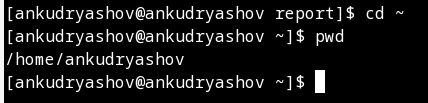
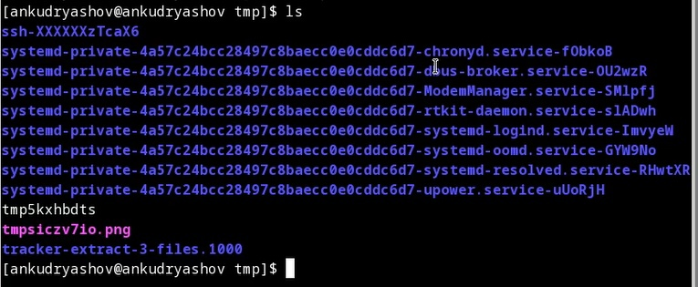
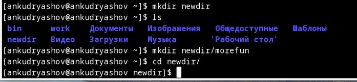
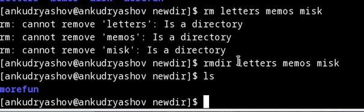
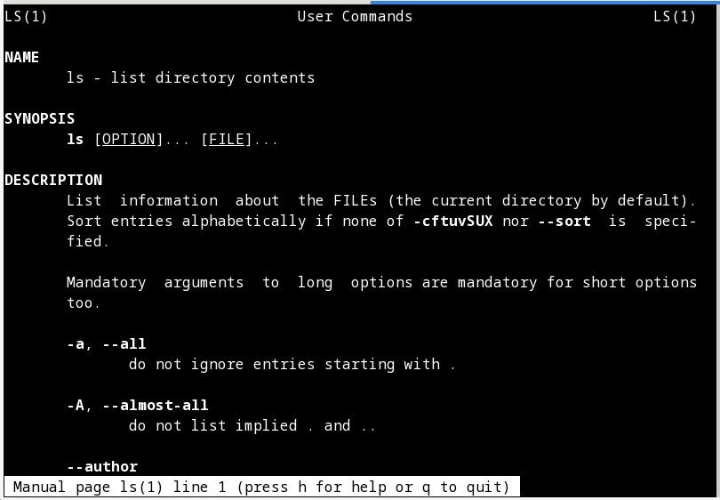
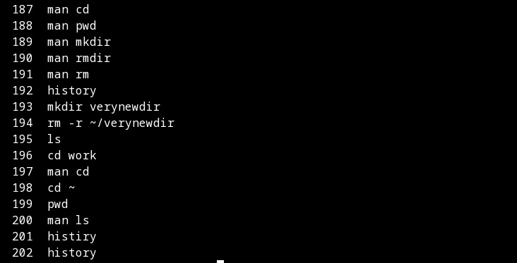

---
## Front matter
lang: ru-RU
title: "Презентация по лабораторной работе №4"
subtitle: "Основы интерфейса взаимодействия пользователя с системой Unix на уровне командной строки"
author:
  - Кудряшов А.Н.
institute:
  - Российский университет дружбы народов, Москва, Россия
date: 4 марта 2023

## i18n babel
babel-lang: russian
babel-otherlangs: english

## Formatting pdf
toc: false
toc-title: Содержание
slide_level: 2
aspectratio: 169
section-titles: true
theme: metropolis
header-includes:
 - \metroset{progressbar=frametitle,sectionpage=progressbar,numbering=fraction}
 - '\makeatletter'
 - '\beamer@ignorenonframefalse'
 - '\makeatother'
---

# Информация

## Докладчик

:::::::::::::: {.columns align=center}
::: {.column width="70%"}

  * Кудряшов Артём Николаевич
  * студент группы НКАбд-02-22
  * Российский университет дружбы народов
  * <https://github.com/ankudryashovNKA>

:::
::: {.column width="30%"}

:::
::::::::::::::

# Вводная часть

## Актуальность

- Работа с командной строкой -- один из главных навыков работы с Linux. Это очень мощный и гибкий инструмент. 

## Цели и задачи

- Освоить набор базовых команд для работы в терминале и узнать их основные опции и применение;
- Создать отчёт по лабораторной работе №4 в Markdown.

## Материалы и методы

- Pdf файл с инструкцией к выполнению лабораторной работы №4

# Основная часть

## Процесс выполнения

  Узнаем полный путь моей домашней папки. Для этого нужна команда pwd.

##

Теперь освоим команду ls, выведем с её помощью содержимое некоторых каталогов, так же изучим некоторые её опции).

##

Далее научимся создавать каталоги используя командную строку. Для этого есть команда mkdir.

##

После того как мы научились создавать каталоги, узнаем как их удалять. Смотрим на команды rm и rmdir.

##

Чтобы узнать набор опций, которые можно применить к какой-либо команде будем использовать команду man (manual).

##

Последней рассматриваемой командой будет команда, которая выводит список из несколькиз десятков выполненных ранее команд. То есть историю терминала -- команда history.

## Результаты

  В ходе выполнения лабораторной работы №4 мы рассмотрели основные команды, используемые в терминале linux. Получили опыт работы с ними и с их опциями (ключами).
  
## Итоговый слайд

  Опыт работы в терминале linux очень важен для каждого программиста. Он даёт доступ к широкому набору команд, которые позволяют упростить свою работу, ускорить её или выполнить действия, которые нельзя повторить в графической среде ОС.

## Список использованной литературы

1. Руководство к лабораторной работе №4, Д.С. Кулябов.

