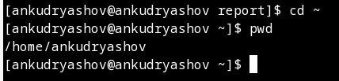
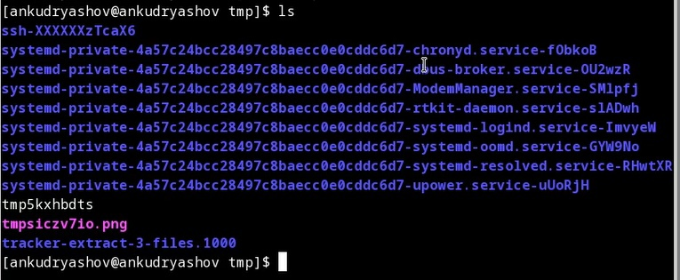
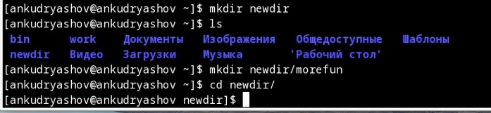
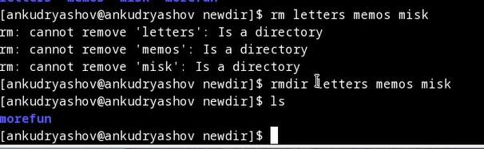
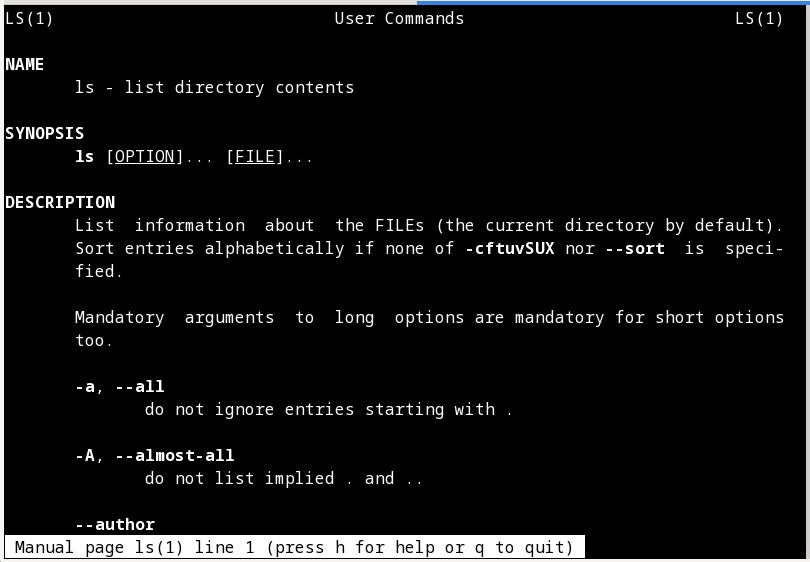
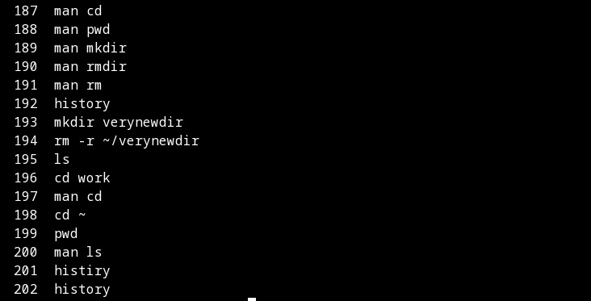

---
## Front matter
title: "Отчёт по лабораторной работе №4"
subtitle: "Дисциплина: Операционные системы"
author: "Кудряшов Артём Николаевич"

## Generic otions
lang: ru-RU
toc-title: "Содержание"

## Bibliography
bibliography: bib/cite.bib
csl: pandoc/csl/gost-r-7-0-5-2008-numeric.csl

## Pdf output format
toc: true # Table of contents
toc-depth: 2
lof: true # List of figures
lot: true # List of tables
fontsize: 12pt
linestretch: 1.5
papersize: a4
documentclass: scrreprt
## I18n polyglossia
polyglossia-lang:
  name: russian
  options:
	- spelling=modern
	- babelshorthands=true
polyglossia-otherlangs:
  name: english
## I18n babel
babel-lang: russian
babel-otherlangs: english
## Fonts
mainfont: PT Serif
romanfont: PT Serif
sansfont: PT Sans
monofont: PT Mono
mainfontoptions: Ligatures=TeX
romanfontoptions: Ligatures=TeX
sansfontoptions: Ligatures=TeX,Scale=MatchLowercase
monofontoptions: Scale=MatchLowercase,Scale=0.9
## Biblatex
biblatex: true
biblio-style: "gost-numeric"
biblatexoptions:
  - parentracker=true
  - backend=biber
  - hyperref=auto
  - language=auto
  - autolang=other*
  - citestyle=gost-numeric
## Pandoc-crossref LaTeX customization
figureTitle: "Рис."
tableTitle: "Таблица"
listingTitle: "Листинг"
lofTitle: "Список иллюстраций"
lotTitle: "Список таблиц"
lolTitle: "Листинги"
## Misc options
indent: true
header-includes:
  - \usepackage{indentfirst}
  - \usepackage{float} # keep figures where there are in the text
  - \floatplacement{figure}{H} # keep figures where there are in the text
---

# Цель работы

Приобретение практических навыков взаимодействия пользователя с системой посредством командной строки.

# Задание

В качестве задания требовалось выполнить определённый набор команд в терминале. Основные: pwd, cd, ls, mkdir, rmdir, rm, history. Также нужно было изучить некоторые опции этих базовых команд.

# Теоретическое введение

ls — покажет содержимое директории, в которой вы находитесь. Если после команды ввести адрес конкретной папки, то она покажет то, что хранится в ней. При добавлении аргумента -R в выводе команды появятся файлы из поддиректорий.

cd — change directory, что в переводе означает «сменить директорию». Из названия понятно, что с помощью этой команды можно перемещаться между папками. Вписываем её, а потом адрес: cd /user/test/dir/111. Есть сокращенные варианты: cd- для перемещения в предыдущую директорию или cd (без аргументов) для прыжка в домашнюю папку.

pwd — укажет полный путь до директории, в которой вы находитесь. Если вы перепрыгнули на рабочий стол с помощью cd ~/Desktop/, то pwd покажет что-то в духе /home/Polzovatel/Desktop.

rm — опасная команда для удаления директорий и их содержимого. Стирает все данные, которые обнаружит в указанной папке без возможности к восстановлению. 

rmdir dir1 - удалить директорию с именем 'dir1'.

history — покажет последние команды, введённые в командную строку.

# Выполнение лабораторной работы

Начнём выполнение лабораторной работы с команды pwd (рис. @fig:001).

{#fig:001 width=70%}

Теперь освоим команду ls, выведем с её помощью содержимое некоторых каталогов, так же изучим некоторые её опции (рис. @fig:002).

{#fig:002 width=70%}

Далее научимся создавать каталоги используя командную строку. Для этого есть команда mkdir (рис. @fig:003).

{#fig:003 width=70%}

После того как мы научились создавать каталоги, узнаем как их удалять. Смотрим на команды rm и rmdir.

{#fig:004 width=70%}

Чтобы узнать набор опций, которые можно применить к какой-либо команде будем использовать команду man (manual) (рис. @fig:004).

{#fig:005 width=70%}

Последней рассматриваемой командой будет команда, которая выводит список из несколькиз десятков выполненных ранее команд. То есть историю терминала -- команда history (рис. @fig:006).

{#fig:006 width=70%}

# Выводы

В ходе выполнения этой лабораторной работы мы научились работать с командной строкой. Мы узнали набор основных команд и опций, используемых с ними.

# Список литературы{.unnumbered}

::: {#refs}
:::
