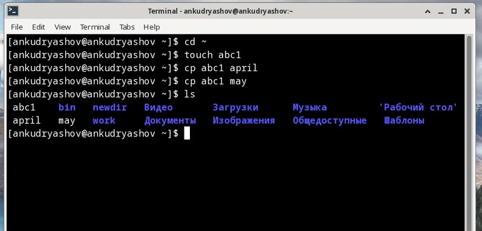
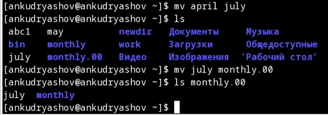
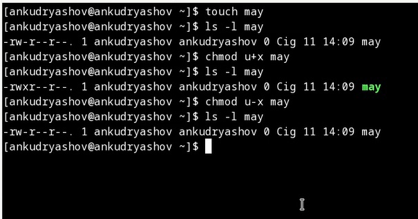
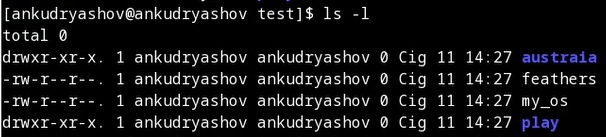
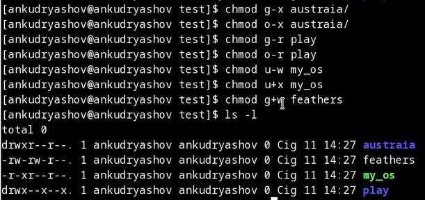
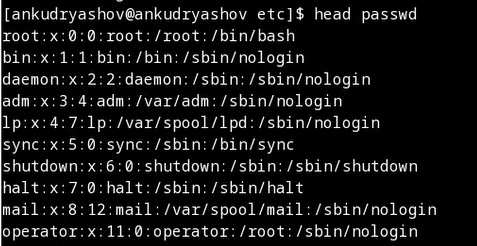
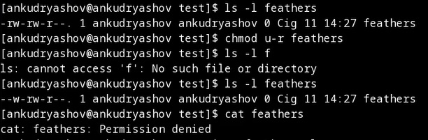
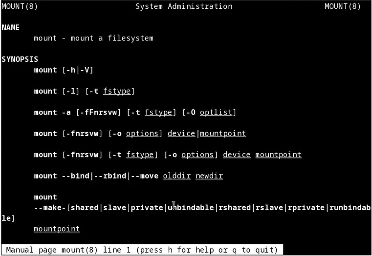

---
## Front matter
lang: ru-RU
title: "Презентация по лабораторной работе №5"
subtitle: "Анализ файловой системы Linux. Команды для работы с файлами и каталогами"
author:
  - Кудряшов А.Н.
institute:
  - Российский университет дружбы народов, Москва, Россия
date: 11 марта 2023

## i18n babel
babel-lang: russian
babel-otherlangs: english

## Formatting pdf
toc: false
toc-title: Содержание
slide_level: 2
aspectratio: 169
section-titles: true
theme: metropolis
header-includes:
 - \metroset{progressbar=frametitle,sectionpage=progressbar,numbering=fraction}
 - '\makeatletter'
 - '\beamer@ignorenonframefalse'
 - '\makeatother'
---

# Информация

## Докладчик

:::::::::::::: {.columns align=center}
::: {.column width="70%"}

  * Кудряшов Артём Николаевич
  * студент группы НКАбд-02-22
  * Российский университет дружбы народов
  * [1132226433@pfur.ru](mailto:1132226433@pfur.ru)
  * <https://github.com/ankudryashovNKA>

:::
::: {.column width="30%"}

:::
::::::::::::::

# Вводная часть

## Актуальность

- Работа с командной строкой -- один из главных навыков работы с Linux. Это очень мощный и гибкий инструмент. 

## Цели и задачи

- Освоить набор базовых команд для работы с файлами и каталогами в системе Unix;
- Создать отчёт по лабораторной работе №5 в Markdown.

## Материалы и методы

- Pdf файл с инструкцией к выполнению лабораторной работы №5

# Основная часть

## Процесс выполнения 1

Создание и копирование файлов. С помощью команды touch можно создать пустой текстовый файл. Создадим файл abc1 и копируем его в этот же каталог с именами april и may с помощью команды cp.

## 2

С помощью команды mv можно переименовывать файлы и каталоги. Переименуем файл april в july. Кроме того, можно перемещать файлы и каталоги. Переместим файл july в созданный каталог monthly.00.

## 3

Изменение прав доступа к файлу. Команда chmod. Дадим владельцу файла право на выполнение файла с помощью команды chmod u+x, затем заберём это право обратно командой chmod u-x.

## 4

Выполним несколько команд на настройку права доступа. Фото до.

## 5

Фото после. Права настроены так, как этого требует задание.

## 6

С помощью команды head выведем первые десять строк файла /etc/passwd.

## 7

Лишим владельца права доступа на чтение файла feathers. Затем с помощью команды cat попробуем просмотреть его. Получим отказ в доступе.

## 8

С помощью man просмотрим некоторые новые команды.

## Результаты

  В ходе выполнения лабораторной работы №5 мы рассмотрели основные команды, используемые для работы с файлами и каталогами в ос linux. Получили опыт работы с командами создания, копирования, перещения и переименования файлов и каталогов. Научились изменять права доступа к ним.
  
## Итоговый слайд

  Опыт работы в терминале linux очень важен для каждого программиста. Он даёт доступ к широкому набору команд, которые позволяют упростить свою работу, ускорить её или выполнить действия, которые нельзя повторить в графической среде ОС.

## Список использованной литературы

1. Руководство к лабораторной работе №5, Д.С. Кулябов.

