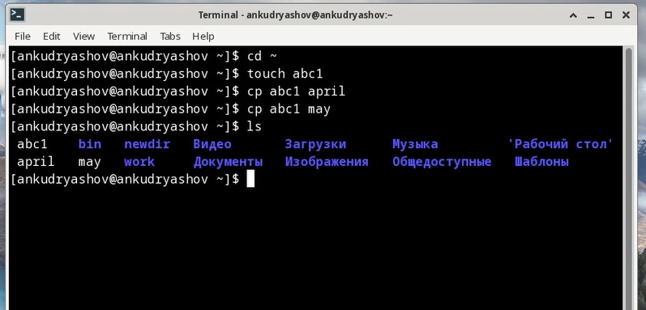
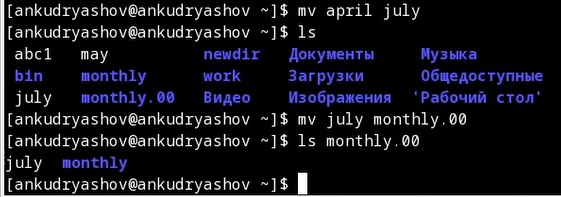
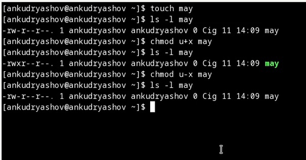
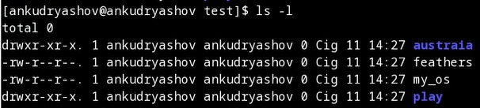
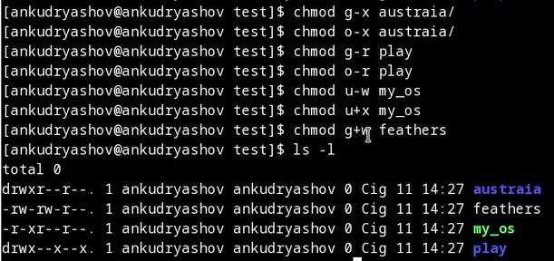
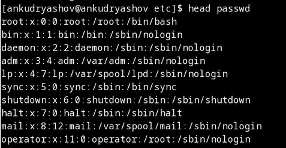
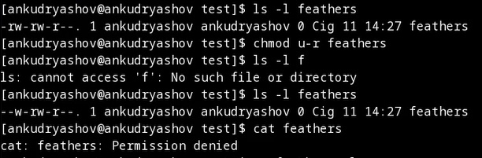
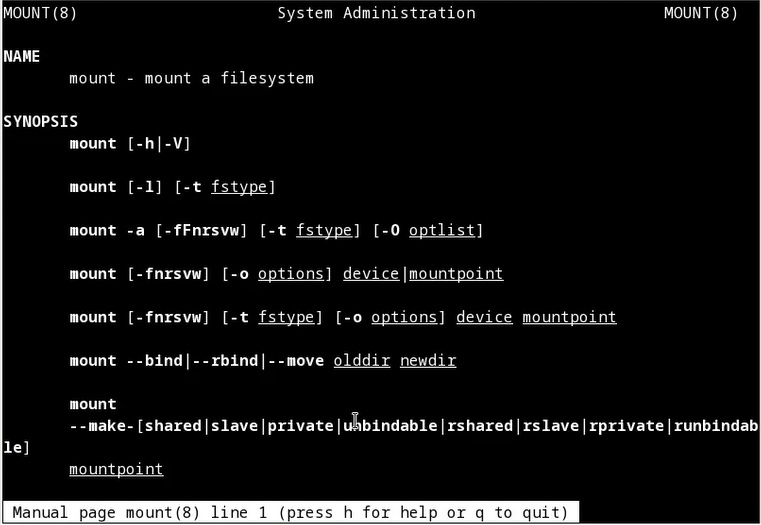

---
## Front matter
title: "Отчёт по лабораторной работе №5"
subtitle: "Дисциплина: Операционные системы"
author: "Кудряшов Артём Николаевич"

## Generic otions
lang: ru-RU
toc-title: "Содержание"

## Bibliography
bibliography: bib/cite.bib
csl: pandoc/csl/gost-r-7-0-5-2008-numeric.csl

## Pdf output format
toc: true # Table of contents
toc-depth: 2
lof: true # List of figures
lot: true # List of tables
fontsize: 12pt
linestretch: 1.5
papersize: a4
documentclass: scrreprt
## I18n polyglossia
polyglossia-lang:
  name: russian
  options:
	- spelling=modern
	- babelshorthands=true
polyglossia-otherlangs:
  name: english
## I18n babel
babel-lang: russian
babel-otherlangs: english
## Fonts
mainfont: PT Serif
romanfont: PT Serif
sansfont: PT Sans
monofont: PT Mono
mainfontoptions: Ligatures=TeX
romanfontoptions: Ligatures=TeX
sansfontoptions: Ligatures=TeX,Scale=MatchLowercase
monofontoptions: Scale=MatchLowercase,Scale=0.9
## Biblatex
biblatex: true
biblio-style: "gost-numeric"
biblatexoptions:
  - parentracker=true
  - backend=biber
  - hyperref=auto
  - language=auto
  - autolang=other*
  - citestyle=gost-numeric
## Pandoc-crossref LaTeX customization
figureTitle: "Рис."
tableTitle: "Таблица"
listingTitle: "Листинг"
lofTitle: "Список иллюстраций"
lotTitle: "Список таблиц"
lolTitle: "Листинги"
## Misc options
indent: true
header-includes:
  - \usepackage{indentfirst}
  - \usepackage{float} # keep figures where there are in the text
  - \floatplacement{figure}{H} # keep figures where there are in the text
---

# Цель работы

Ознакомление с файловой системой Linux, её структурой, именами и содержанием каталогов. Приобретение практических навыков по применению команд для работы с файлами и каталогами, по управлению процессами (и работами), по проверке использования диска и обслуживанию файловой системы.

# Задание

В качестве задания требовалось выполнить определённый набор команд в терминале. Большая часть из них касалась темы создания, копирования, перемещения и переименования файлов и каталогов, а также изменения прав доступа к ним (команды touch, cp, mv, chmod). 

# Теоретическое введение

Команда "touch" - это программа, используемая в операционных системах Linux для создания, редактирования и изменения временных меток конкретного файла.

Команда "cp" копирует файл или каталог, указанный в параметре Исходный_файл или Исходный_каталог, в файл или каталог, заданный в параметре Целевой_файл или Целевой_каталог. Если Целевой_файл существует, то его содержимое заменяется без предупреждения.

Команда "mv" используется для перемещения одного или нескольких файлов (или директорий) в другую директорию, а также для переименования файлов и директорий.

Команда "chmod" (change mode – сменить режим) предназначена для изменения прав доступа к файлам и каталогам в Unix-подобных операционных системах. Ключи необязательны. Устанавливать права можно двумя способами: с помощью буквенного обозначения прав (rwx) и с помощью числового в восьмеричной системе счисления.

# Выполнение лабораторной работы

Создание и копирование файлов. С помощью команды touch можно создать пустой текстовый файл. Создадим файл abc1 и копируем его в этот же каталог с именами april и may с помощью команды cp (рис. @fig:001).

{#fig:001 width=70%}

С помощью команды mv можно переименовывать файлы и каталоги. Переименуем файл april в july. Кроме того, можно перемещать файлы и каталоги. Переместим файл july в созданный каталог monthly.00 (рис. @fig:002).

{#fig:002 width=70%}

Изменение прав доступа к файлу. Команда chmod. Дадим владельцу файла право на выполнение файла с помощью команды chmod u+x, затем заберём это право обратно командой chmod u-x (рис. @fig:003).

{#fig:003 width=70%}

Выполним несколько команд на настройку права доступа. Фото до (рис. @fig:004).

{#fig:004 width=70%}

Фото после. Права настроены так, как этого требует задание (рис. @fig:005).

{#fig:005 width=70%}

С помощью команды head выведем первые десять строк файла /etc/passwd (рис. @fig:006).

{#fig:006 width=70%}

Лишим владельца права доступа на чтение файла feathers. Затем с помощью команды cat попробуем просмотреть его. Получим отказ в доступе (рис. @fig:007).

{#fig:007 width=70%}

С помощью man просмотрим некоторые новые команды (рис. @fig:008).

{#fig:008 width=70%}

# Выводы

В ходе выполнения этой лабораторной работы мы научились работать с файловой системой Unix. Копировать, перемещать, переименовывать файлы и каталоги. Изменять права доступа к ним.

# Список литературы{.unnumbered}

::: {#refs}
:::
