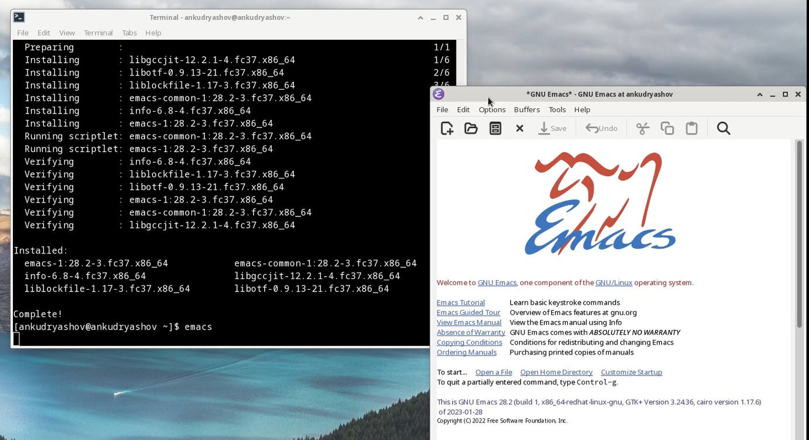
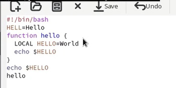
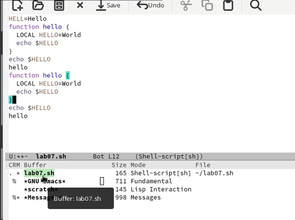
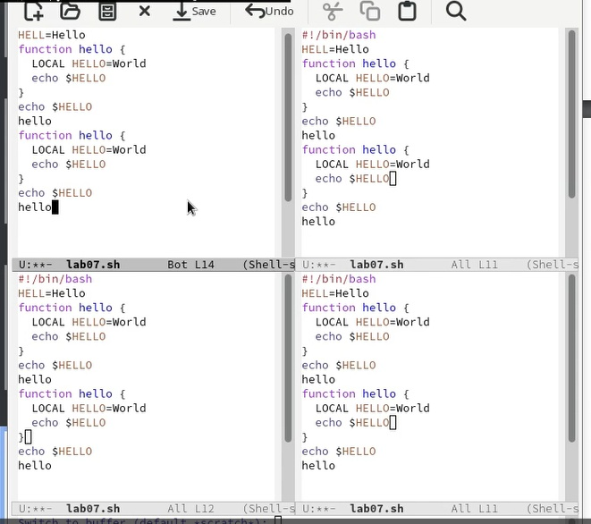
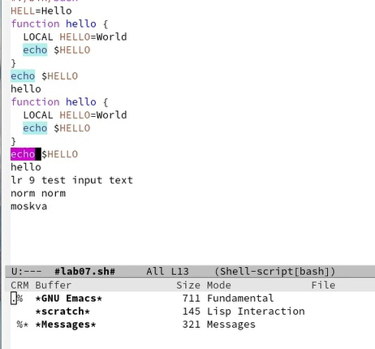
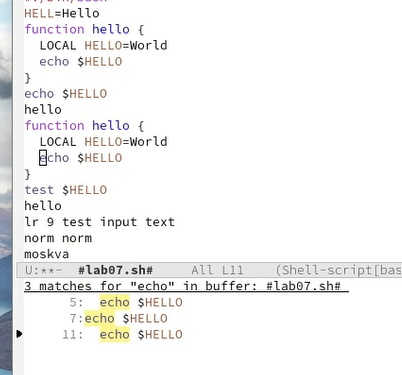

---
## Front matter
lang: ru-RU
title: "Презентация по лабораторной работе №9"
subtitle: "Анализ файловой системы Linux. Команды для работы с файлами и каталогами"
author:
  - Кудряшов А.Н.
institute:
  - Российский университет дружбы народов, Москва, Россия
date: 8 апреля 2023

## i18n babel
babel-lang: russian
babel-otherlangs: english

## Formatting pdf
toc: false
toc-title: Содержание
slide_level: 2
aspectratio: 169
section-titles: true
theme: metropolis
header-includes:
 - \metroset{progressbar=frametitle,sectionpage=progressbar,numbering=fraction}
 - '\makeatletter'
 - '\beamer@ignorenonframefalse'
 - '\makeatother'
---

# Информация

## Докладчик

:::::::::::::: {.columns align=center}
::: {.column width="70%"}

  * Кудряшов Артём Николаевич
  * студент группы НКАбд-02-22
  * Российский университет дружбы народов
  * [1132226433@pfur.ru](mailto:1132226433@pfur.ru)
  * <https://github.com/ankudryashovNKA>

:::
::: {.column width="30%"}

:::
::::::::::::::

# Вводная часть

## Актуальность

- Текстовый редактор ecams имеет широкий набор функций и даёт много возможностей для работы с текстовыми файлами. Его освоение может сильно упростить жизнь на linux.

## Цели и задачи

- Познакомиться с операционной системой Linux. Получить практические навыки работы с редактором Emacs.
- Создать отчёт по лабораторной работе №6 в Markdown.

## Материалы и методы

- Pdf файл с инструкцией к выполнению лабораторной работы №9

# Основная часть

## Процесс выполнения 1

Начнём с установки редактора ecams. Пропишем команду sudo dnf install ecams и запустим установленный редактор.

{#fig:001 width=70%}

## 2

С помощью горячих клавиш C-x и C-f создадим новый файл lab07.sh и вставим туда какой-то текст.

{#fig:002 width=70%}

## 3

Чуть-чуть поработаем с буферами. С помощью клавиш C-x и C-b откроем буфер.

{#fig:003 width=70%}

## 4

Разделим наш фрейм на 4 окна с помощью клавиш C-x 3 и C-x 2.

{#fig:004 width=70%}

## 5

Попробуем найти в тексте какое-нибудь слово с помощью сочетяния клавиш C-s.

{#fig:005 width=70%}

## 6

Протестируем другой режим поиска с помощью клавиш M-s o.

{#fig:006 width=70%}

## Результаты

В ходе выполнения этой лабораторной работы мы научились работать с текстовым редактором emacs. Выполнять базовые операции - управлять курсором, работать с буфером, вырезанить и вставлять строки, разбивать фрейм на окна, искать слова в тексте и т.д.
  
## Итоговый слайд

  Опыт работы в редакторе ecams нужен каждому пользователю linux. Ecams довольно прост в использовании при этом предоставляет широкие возможности. Мне понравилось в нём работать.

## Список использованной литературы

1. Руководство к лабораторной работе №9, Д.С. Кулябов.

