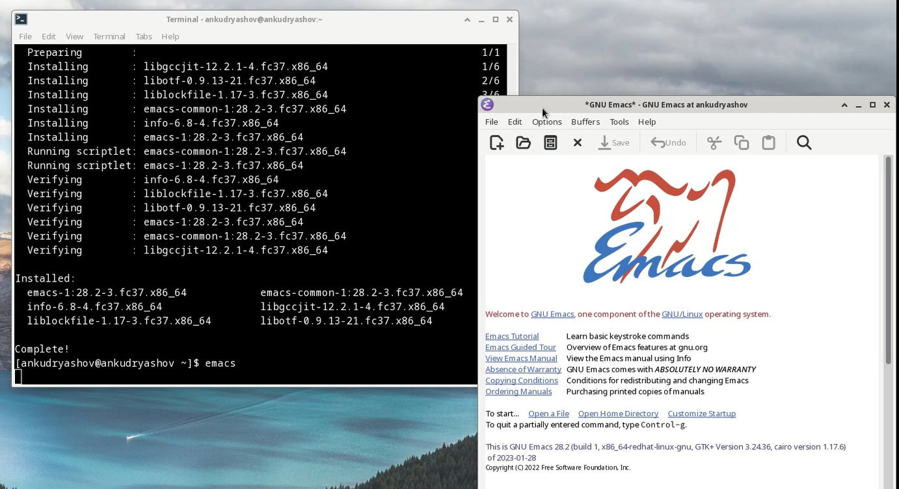
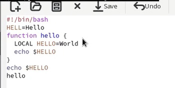
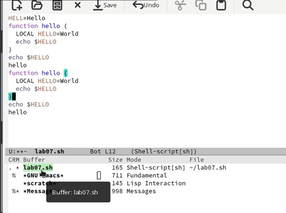
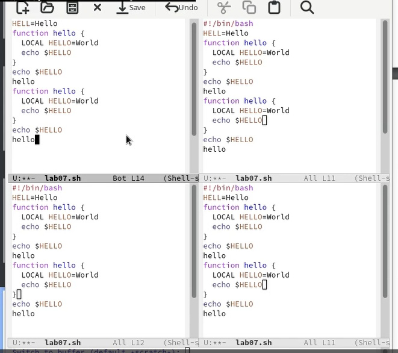
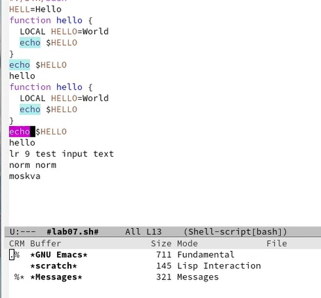
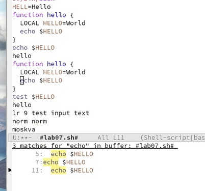

---
## Front matter
title: "Отчёт по лабораторной работе №9"
subtitle: "Дисциплина: Операционные системы"
author: "Кудряшов Артём Николаевич"

## Generic otions
lang: ru-RU
toc-title: "Содержание"

## Bibliography
bibliography: bib/cite.bib
csl: pandoc/csl/gost-r-7-0-5-2008-numeric.csl

## Pdf output format
toc: true # Table of contents
toc-depth: 2
lof: true # List of figures
lot: true # List of tables
fontsize: 12pt
linestretch: 1.5
papersize: a4
documentclass: scrreprt
## I18n polyglossia
polyglossia-lang:
  name: russian
  options:
	- spelling=modern
	- babelshorthands=true
polyglossia-otherlangs:
  name: english
## I18n babel
babel-lang: russian
babel-otherlangs: english
## Fonts
mainfont: PT Serif
romanfont: PT Serif
sansfont: PT Sans
monofont: PT Mono
mainfontoptions: Ligatures=TeX
romanfontoptions: Ligatures=TeX
sansfontoptions: Ligatures=TeX,Scale=MatchLowercase
monofontoptions: Scale=MatchLowercase,Scale=0.9
## Biblatex
biblatex: true
biblio-style: "gost-numeric"
biblatexoptions:
  - parentracker=true
  - backend=biber
  - hyperref=auto
  - language=auto
  - autolang=other*
  - citestyle=gost-numeric
## Pandoc-crossref LaTeX customization
figureTitle: "Рис."
tableTitle: "Таблица"
listingTitle: "Листинг"
lofTitle: "Список иллюстраций"
lotTitle: "Список таблиц"
lolTitle: "Листинги"
## Misc options
indent: true
header-includes:
  - \usepackage{indentfirst}
  - \usepackage{float} # keep figures where there are in the text
  - \floatplacement{figure}{H} # keep figures where there are in the text
---

# Цель работы

Познакомиться с операционной системой Linux. Получить практические навыки работы с редактором Emacs.

# Задание

В качестве задания требовалось выполнить определённый набор команд в редакторе ecams. Например, выделять строки, вырезать и вставлять их, заниматься поиском слов и разделять фрейм на раные окна.

# Теоретическое введение

Определение 1. Буфер — объект, представляющий какой-либо текст.

Определение 2. Фрейм соответствует окну в обычном понимании этого слова. Каждый
фрейм содержит область вывода и одно или несколько окон Emacs.

Определение 3. Окно — прямоугольная область фрейма, отображающая один из буферов.

Определение 4. Область вывода — одна или несколько строк внизу фрейма, в которой
Emacs выводит различные сообщения, а также запрашивает подтверждения и дополнительную информацию от пользователя.

Определение 5. Минибуфер используется для ввода дополнительной информации и всегда отображается в области вывода.

Определение 6. Точка вставки — место вставки (удаления) данных в буфере.

# Выполнение лабораторной работы

Начнём с установки редактора ecams. Пропишем команду sudo dnf install ecams и запустим установленный редактор (рис. @fig:002).

{#fig:001 width=70%}

С помощью горячих клавиш C-x и C-f создадим новый файл lab07.sh и вставим туда какой-то текст (рис. @fig:002).

{#fig:002 width=70%}

Чуть-чуть поработаем с буферами. С помощью клавиш C-x и C-b откроем буфер (рис. @fig:003).

{#fig:003 width=70%}

Разделим наш фрейм на 4 окна с помощью клавиш C-x 3 и C-x 2 (рис. @fig:004).

{#fig:004 width=70%}

Попробуем найти в тексте какое-нибудь слово с помощью сочетяния клавиш C-s (рис. @fig:005).

{#fig:005 width=70%}

Протестируем другой режим поиска с помощью клавиш M-s o (рис. @fig:006).

{#fig:006 width=70%}

# Выводы

В ходе выполнения этой лабораторной работы мы научились работать с текстовым редактором emacs. Выполнять базовые операции - управлять курсором, работать с буфером, вырезанить и вставлять строки, разбивать фрейм на окна, искать слова в тексте и т.д.

# Список литературы{.unnumbered}

::: {#refs}
:::
