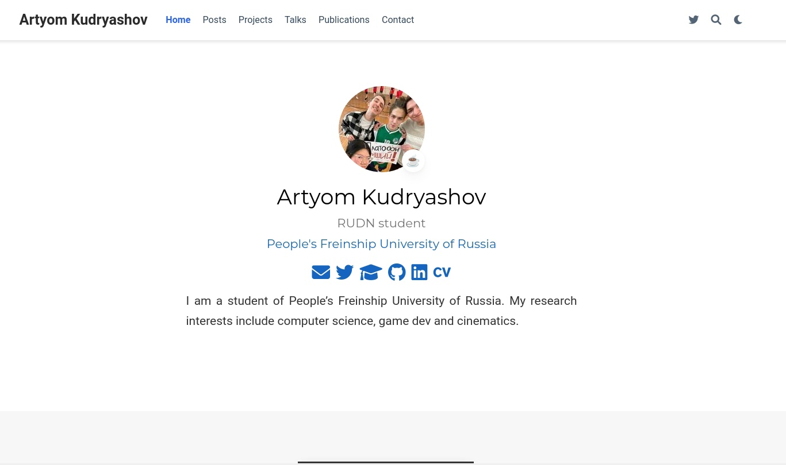
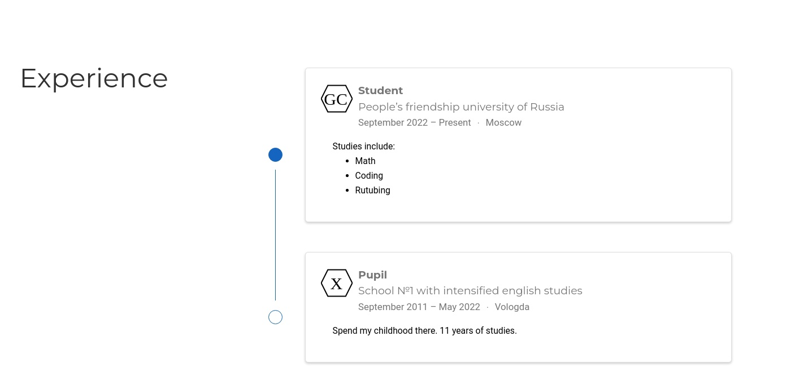
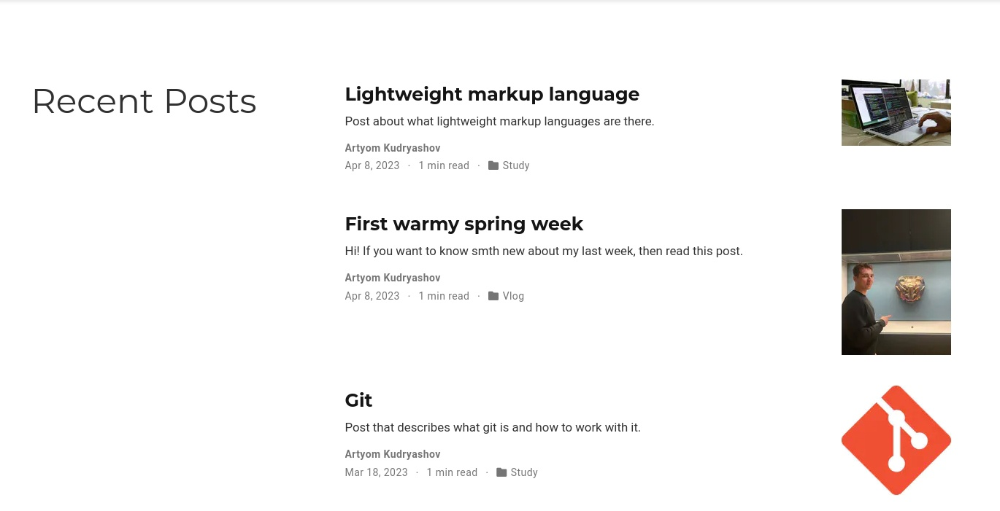

---
## Front matter
lang: ru-RU
title: "Презентация по индивидуальному проекту этап №3"
subtitle: "Продолжаем обновлять наш сайт"
author:
  - Кудряшов А.Н.
institute:
  - Российский университет дружбы народов, Москва, Россия
date: 8 апреля 2023

## i18n babel
babel-lang: russian
babel-otherlangs: english

## Formatting pdf
toc: false
toc-title: Содержание
slide_level: 2
aspectratio: 169
section-titles: true
theme: metropolis
header-includes:
 - \metroset{progressbar=frametitle,sectionpage=progressbar,numbering=fraction}
 - '\makeatletter'
 - '\beamer@ignorenonframefalse'
 - '\makeatother'
---

# Информация

## Докладчик

:::::::::::::: {.columns align=center}
::: {.column width="70%"}

  * Кудряшов Артём Николаевич
  * студент группы НКАбд-02-22
  * Российский университет дружбы народов
  * [1132226433@pfur.ru](mailto:1132226433@pfur.ru)
  * <https://github.com/ankudryashovNKA>

:::
::: {.column width="30%"}

:::
::::::::::::::

# Вводная часть

## Актуальность

- Поддержание сайта и наполнение его контентом - первоочередная задача индивидуального проекта

## Цели и задачи

- Продолжить наполнение персонального сайта на hugo первоклассным контентом.
- Создать отчёт по лабораторной работе №6 в Markdown.

## Материалы и методы

- Список задач для выполнения к этапу №3

# Основная часть

## Процесс выполнения 1

Запустим сервер и перейдем на localhost.

{#fig:001 width=70%}

## 2

Изменим файл index.md в папке content так, чтобы подстроить его под свои скиллы.

{#fig:002 width=70%}

## 3

Теперь поработаем над изменением блока Experience. Добавим информацию об учёбе в школе и начале обучения в ВУЗе.

{#fig:003 width=70%}

## 4

Далее персонифицируем блок Accomplishments. Не будем подходить к этому сльшком серьёзно.

{#fig:004 width=70%}

## 5

Наконец, напишем два поста. Один про прошлую неделю, второй про легковесные языки разметки. Для этого повторим синтаксис языка Markdown.

{#fig:005 width=70%}

## 6

В результате получили такие исходники.

{#fig:006 width=70%}

## Результаты

В ходе выполнения этого этапа работы над индивидуальным проектом удалось выполнить все задания. Мы кастомизировали все необходимые блоки главной страниц и добавили два поста на актуальные темы. Сайт живёт и обновляется.
  
## Итоговый слайд

Работа над своим сайтом - творческое занятие. Довольно интересно подстраивать все разделы сайта под себя, писать посты про свою жизнь и другие интересные темы.

## Список использованной литературы

1. Не было(

