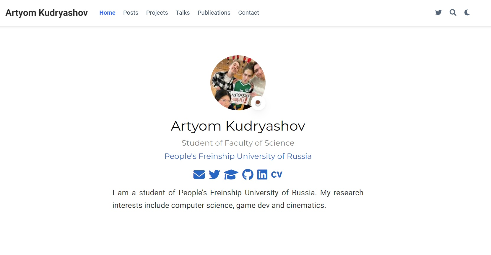
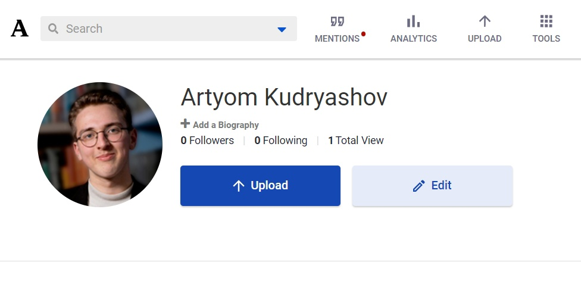
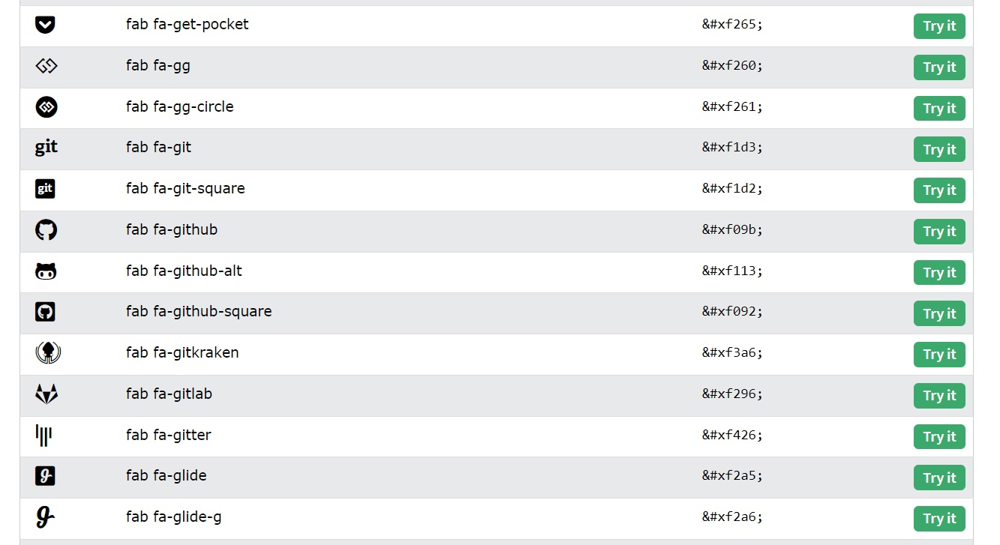
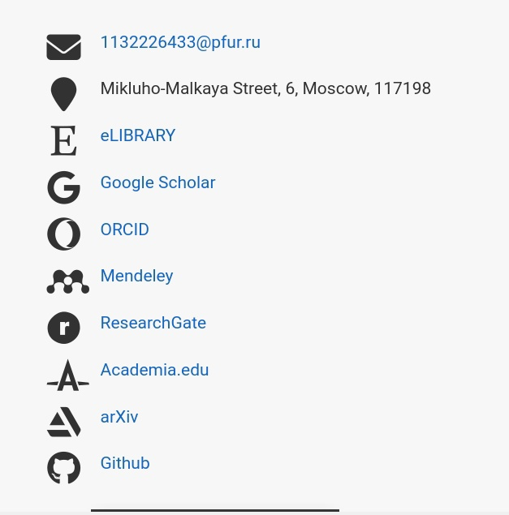
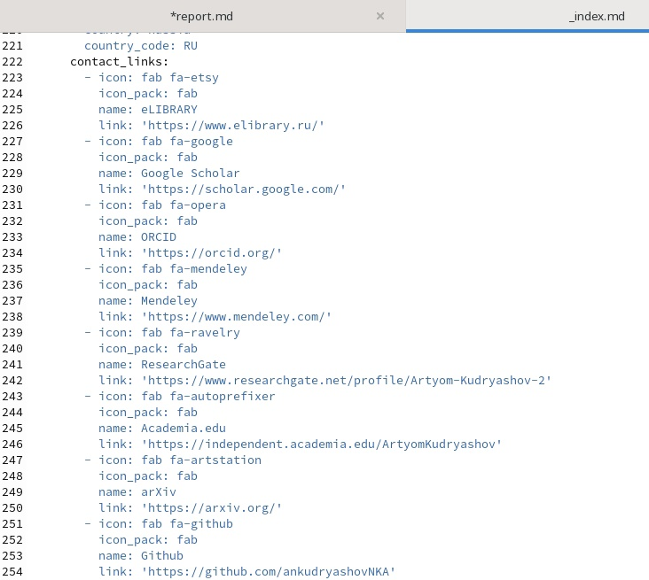
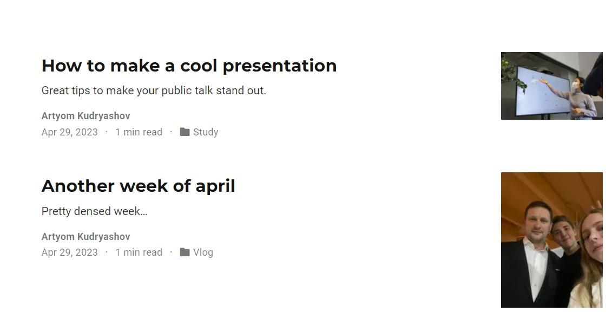

---
## Front matter
lang: ru-RU
title: "Презентация по индивидуальному проекту этап №4"
subtitle: "Продолжаем обновлять наш сайт"
author:
  - Кудряшов А.Н.
institute:
  - Российский университет дружбы народов, Москва, Россия
date: 29 апреля 2023

## i18n babel
babel-lang: russian
babel-otherlangs: english

## Formatting pdf
toc: false
toc-title: Содержание
slide_level: 2
aspectratio: 169
section-titles: true
theme: metropolis
header-includes:
 - \metroset{progressbar=frametitle,sectionpage=progressbar,numbering=fraction}
 - '\makeatletter'
 - '\beamer@ignorenonframefalse'
 - '\makeatother'
---

# Информация

## Докладчик

:::::::::::::: {.columns align=center}
::: {.column width="70%"}

  * Кудряшов Артём Николаевич
  * студент группы НКАбд-02-22
  * Российский университет дружбы народов
  * [1132226433@pfur.ru](mailto:1132226433@pfur.ru)
  * <https://github.com/ankudryashovNKA>

:::
::: {.column width="30%"}

:::
::::::::::::::

# Вводная часть

## Актуальность

- Поддержание сайта и наполнение его контентом - первоочередная задача индивидуального проекта

## Цели и задачи

- Обновить список возможных контактов на сайте.
- Добавить два новых поста (о прошедшей и о создании презентаций).

## Материалы и методы

- Список задач для выполнения к этапу №4

# Основная часть

## Процесс выполнения 1

Запустим сервер и перейдем на localhost.

{#fig:001 width=70%}

## 2

Зарегистрируемся на всех необходимых ресурсах.

{#fig:002 width=70%}

## 3

Подберем значки для отображения в листе контактов. Для этого перейдем на специальный сайт с иконками.

{#fig:003 width=70%}

## 4

В результате получаем такой блок контактов.

{#fig:004 width=70%}

## 5

Получили такой исходный код в файле index.md.

{#fig:005 width=70%}

## 6

Напишем два поста для нашего сайта: один по прошедшей неделе, другой про создание презентаций.

{#fig:006 width=70%}

## Результаты

В ходе выполнения этого этапа работы над индивидуальным проектом удалось выполнить все задания. Мы кастомизировали контакты и добавили два поста на актуальные темы. Сайт живёт и обновляется.
  
## Итоговый слайд

Работа над своим сайтом - творческое занятие. Довольно интересно подстраивать все разделы сайта под себя, писать посты про свою жизнь и другие интересные темы.

## Список использованной литературы

1. Не было(

